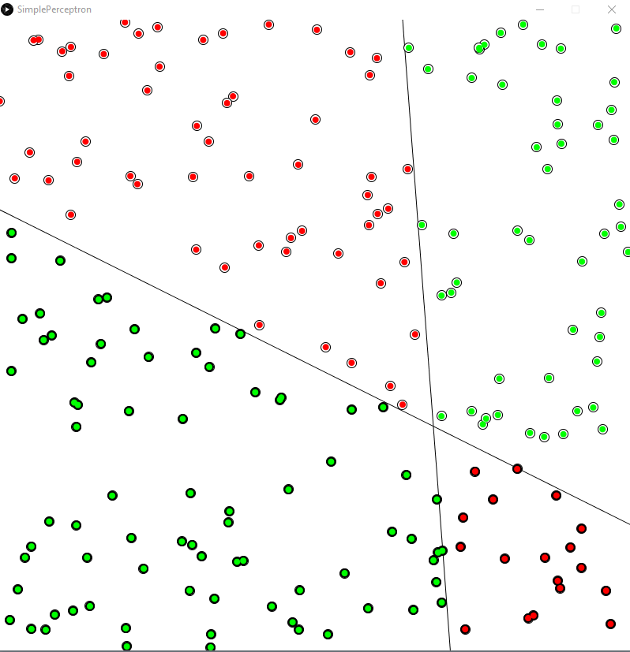

# Processing
A collection of little projects written in the Processing coding environment.

# SimplePerceptron
A model of a perception (a single neuron in a larger scale nerural network) which learns the equation of a line.

